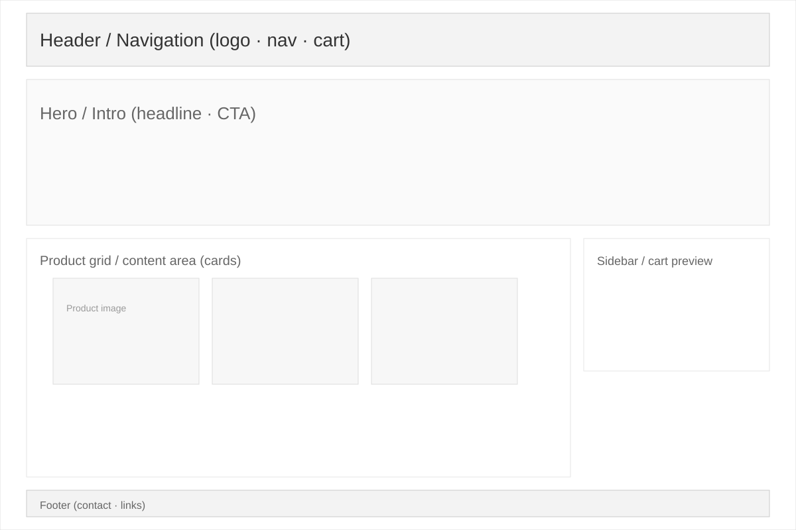
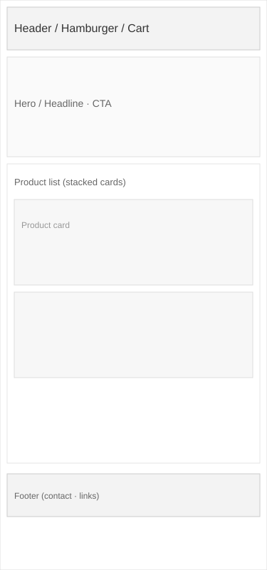

# CraveCart

## Project Purpose and Target User

CraveCart is a single-page food ordering website designed to help users quickly browse meals, filter menu options, and place an order with minimal effort. The goal of the project is to create a clean and user-friendly digital food ordering experience that applies Human-Computer Interaction (HCI) principles to improve usability and accessibility.

This website is intended for busy students, office workers, and families who want to order food quickly without dealing with a confusing or cluttered interface. It focuses on convenience, readability, and a smooth checkout experience.

## Overview

CraveCart is a front-end website for a modern food delivery business. It includes a hero section, menu browsing, category filtering, a shopping cart, and a checkout form. The layout is built to be clear, responsive, and easy to navigate on both desktop and mobile screens.

## Features

- Responsive single-page layout
- Search bar for menu items
- Category filtering for different food types
- Interactive cart with quantity controls
- Checkout form with validation
- Clear visual hierarchy and modern food brand styling
- Mobile-friendly design

## Visuals

The following wireframe mockups represent the original layout ideas used for the project:





## Prerequisites

To run this project locally, make sure you have:

- A modern web browser (Chrome, Edge, Firefox, or Safari)
- A text editor or IDE such as VS Code
- Optional: Python 3.x for serving the project locally via a simple HTTP server

## Installation

1. Download or clone the project folder.
2. Open the project directory in your preferred editor.
3. Open `index.html` directly in a browser, or run a local server:

```bash
cd "HCI Website"
python -m http.server 8000
```

Then visit:

```text
http://localhost:8000
```

## Usage

1. Open the website in your browser.
2. Browse the available dishes or use the search field.
3. Click `Add to Cart` for any item.
4. Adjust item quantities in the cart panel.
5. Fill out the checkout form and place the order.
6. Observe the feedback messages and order summary.

## HCI Heuristics Applied

The following table shows the usability principles used in the project and where they were applied:

| Heuristic | How it was applied in the site |
| --- | --- |
| Visibility of system status | Cart count updates when items are added, and the checkout form provides confirmation feedback after placing an order. |
| Match between system and the real world | Common restaurant labels such as `Cart`, `Menu`, `Home`, and `Checkout` use familiar wording and simple actions. |
| User control and freedom | The user can add, remove, increase, or decrease cart items at any time and can navigate back using the navigation links. |
| Consistency and standards | Repeated button styles, font sizes, spacing, and section layouts are kept consistent throughout the website. |
| Error prevention | The checkout form uses required fields and validates missing customer details before submission. |
| Recognition over recall | Navigation is always visible in the header, and menu categories remain easy to recognize without memorization. |
| Aesthetic and minimalist design | The interface uses clean spacing, limited color accents, and meaningful content so the design feels uncluttered. |
| Accessibility | Semantic HTML elements are used, images include alt text, form fields are labeled, and text contrast is designed to remain readable. |

## What I Would Improve with More Time

One thing I would improve is the backend integration for real order processing and user data management. Right now, the site is a strong front-end prototype, but a real food ordering system would need a database, secure checkout process, and persistent order storage. This would make the experience more realistic and useful for actual users.

## Contributing

This project is intended as an individual front-end website assignment. If you want to improve the design or functionality:

1. Fork the repository or copy the project folder.
2. Create a new branch for your changes.
3. Make your improvements and test them in a browser.
4. Submit a clear pull request or share the updated version with your instructor.

## License

This project is currently shared for educational use and is not designated for commercial distribution unless otherwise stated by the instructor or owner.

## Project Summary

CraveCart demonstrates how a simple front-end website can apply HCI principles to create a functional, attractive, and user-friendly product. It balances restaurant branding, usability, and responsive design while keeping the interface simple and accessible for everyday use.

This README serves as the project documentation submission as approved for this assignment.
